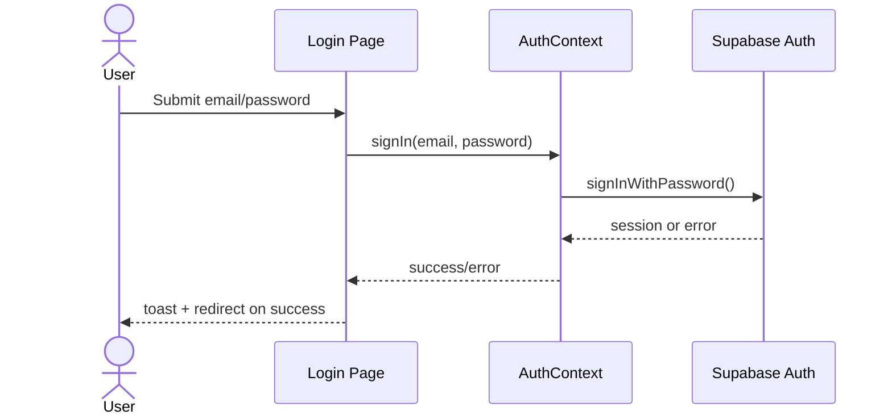
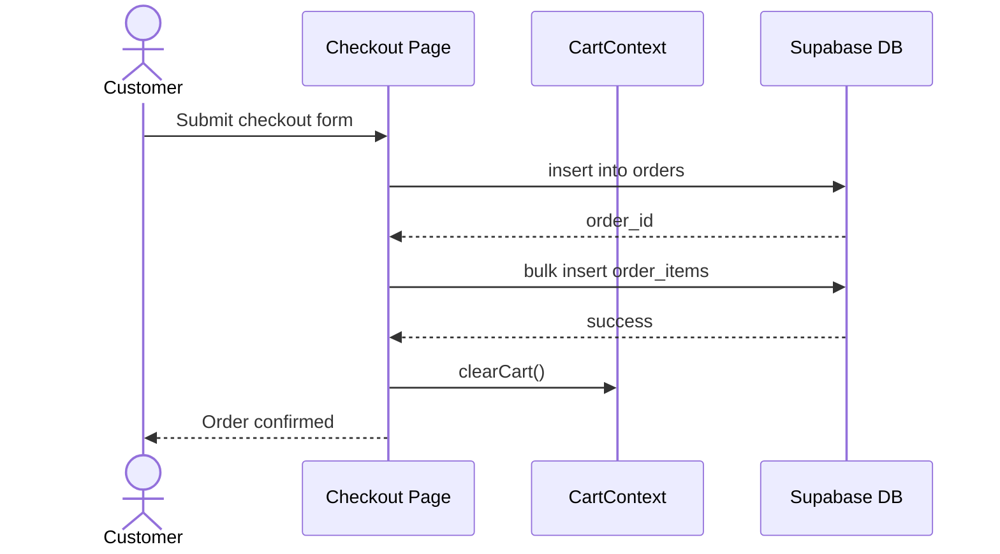
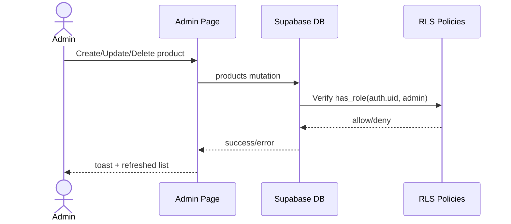

# Equipa Project Report and UML Documentation

## 1. Executive Summary

Equipa is a full-stack e-commerce web application for home equipment and appliances. The frontend is built with React, TypeScript, Vite, Tailwind CSS, and shadcn-style UI components. The backend is powered by Supabase (PostgreSQL, Auth, Row Level Security, RPC).

The system supports:

- Public product browsing.
- Authentication (sign up/sign in/sign out).
- Cart management.
- Order placement with cash-on-delivery workflow.
- User order tracking.
- Role-based admin panel for product management and order status updates.

The architecture follows a client-centric SPA model with direct secured Supabase access controlled by RLS policies.

## 2. Problem Statement and Goals

### 2.1 Problem

Users need a simple online way to discover home equipment products, place orders, and track their purchases, while administrators need a lightweight back office to manage catalog and fulfillment.

### 2.2 Goals

- Provide a responsive and intuitive shopping experience.
- Enforce secure data access per user role.
- Minimize backend boilerplate by using managed Supabase services.
- Keep the codebase modular and maintainable.

## 3. Scope

### 3.1 In Scope

- Product catalog display and category filtering.
- Product detail view and cart operations.
- Checkout with user delivery details.
- Order persistence (orders + order items).
- User order history.
- Admin product CRUD and order status update.

### 3.2 Out of Scope (Current Version)

- Real online payments.
- Inventory/stock management.
- Discount/coupon engine.
- Multi-language support.
- Advanced analytics dashboard.

## 4. Technology Stack

- Frontend framework: React 18 + TypeScript
- Build tool: Vite 5
- Styling: Tailwind CSS + utility tokens in global CSS
- UI primitives: Radix-based components in local ui library
- Routing: React Router
- State management:
  - Auth state via AuthContext
  - Cart state via CartContext
  - Data fetching integrated with Supabase calls
- Backend as a service: Supabase
  - Auth users
  - PostgreSQL database
  - RLS policies
  - SQL function has_role for authorization logic
- Testing baseline:
  - Vitest (unit test setup exists)
  - Playwright config scaffold exists

## 5. High-Level Architecture

The frontend (SPA) communicates directly with Supabase using the public URL and publishable key. Authorization and data protection are enforced in database policies (RLS), not in frontend-only checks.

Key architectural characteristics:

- Clear separation between presentation (pages/components), client state (contexts), and persistence (Supabase).
- Role-based behavior implemented by combining UI checks and DB policy constraints.
- Minimal custom backend layer, reducing operational complexity.

## 6. Functional Description

### 6.1 Public User Features

- Home page with hero, category shortcuts, featured products.
- Shop page with category filter and local text search.
- Product detail with quantity selector.
- Category and contact pages.

### 6.2 Authenticated User Features

- Sign up and sign in.
- Add/remove/update cart items.
- Checkout with full name, phone, address.
- Place order and persist line items.
- View personal order history.

### 6.3 Admin Features

- Access admin panel if user has admin role.
- Create, edit, delete products.
- View all orders.
- Update order status (pending/delivered).

## 7. Data Model and Security

### 7.1 Main Tables

- products
- orders
- order_items
- user_roles

### 7.2 Security Strategy

- Row Level Security enabled on all core tables.
- Public read access for products.
- Write access for products restricted to admin role.
- Users can read only their own orders and order items.
- Admin can read/update all orders.
- user_roles management restricted to admin.

### 7.3 Authorization Function

- SQL function has_role(user_id, role) used in policies.
- Role enum app_role: admin, user.

## 8. UML Diagram Set

The following diagrams model the implemented system from different viewpoints.

## 8.1 Use Case Diagram

~~~mermaid
flowchart LR
    Visitor([Visitor])
    Customer([Authenticated Customer])
    Admin([Admin])

    UC1((Browse Products))
    UC2((Filter/Search Products))
    UC3((View Product Detail))
    UC4((Sign Up / Sign In))
    UC5((Manage Cart))
    UC6((Checkout))
    UC7((View My Orders))
    UC8((Manage Products))
    UC9((Manage Order Status))

    Visitor --> UC1
    Visitor --> UC2
    Visitor --> UC3
    Visitor --> UC4

    Customer --> UC1
    Customer --> UC2
    Customer --> UC3
    Customer --> UC5
    Customer --> UC6
    Customer --> UC7

    Admin --> UC8
    Admin --> UC9
~~~

## 8.2 Class Diagram

~~~mermaid
classDiagram
    class AuthContext {
      +User? user
      +boolean isAdmin
      +boolean loading
      +signUp(email, password)
      +signIn(email, password)
      +signOut()
    }

    class CartContext {
      +CartItem[] items
      +number totalPrice
      +number totalItems
      +addItem(product)
      +removeItem(productId)
      +updateQuantity(productId, quantity)
      +clearCart()
    }

    class Product {
      +uuid id
      +string name
      +string description
      +decimal price
      +string image_url
      +string category
      +datetime created_at
    }

    class Order {
      +uuid id
      +uuid user_id
      +string full_name
      +string phone
      +string address
      +decimal total_price
      +string status
      +datetime created_at
    }

    class OrderItem {
      +uuid id
      +uuid order_id
      +uuid product_id
      +int quantity
      +decimal price
    }

    class UserRole {
      +uuid id
      +uuid user_id
      +app_role role
    }

    class SupabaseClient {
      +from(table)
      +auth.signUp()
      +auth.signInWithPassword()
      +auth.signOut()
      +rpc(name, args)
    }

    AuthContext --> SupabaseClient : uses
    CartContext --> Product : contains
    Order "1" --> "many" OrderItem : includes
    Product "1" --> "many" OrderItem : referenced by
    UserRole --> AuthContext : determines isAdmin
~~~

## 8.3 Component Diagram

~~~mermaid
flowchart TB
    subgraph Client[React SPA]
      App[App Shell]
      Nav[Navbar/Footer]
      Pages[Pages Layer]
      AuthC[Auth Context]
      CartC[Cart Context]
      UI[UI Components]
    end

    subgraph Services[Supabase Services]
      Auth[Supabase Auth]
      DB[(PostgreSQL Database)]
      RLS[RLS Policies]
      RPC[RPC has_role]
    end

    App --> Nav
    App --> Pages
    Pages --> UI
    Pages --> AuthC
    Pages --> CartC
    AuthC --> Auth
    AuthC --> RPC
    Pages --> DB
    DB --> RLS
~~~

## 8.4 Deployment Diagram

~~~mermaid
flowchart LR
    UserDevice[User Browser]
    ViteHost[Web Hosting - Vite Build Output]
    SupabaseCloud[Supabase Cloud Project]
    Postgres[(Managed PostgreSQL)]

    UserDevice -->|HTTPS| ViteHost
    UserDevice -->|HTTPS API calls| SupabaseCloud
    SupabaseCloud --> Postgres
~~~

## 8.5 Package Diagram

~~~mermaid
flowchart TB
    src[src]
    components[components]
    pages[pages]
    contexts[contexts]
    integrations[integrations/supabase]
    ui[components/ui]

    src --> components
    src --> pages
    src --> contexts
    src --> integrations
    components --> ui
    pages --> contexts
    pages --> integrations
~~~

## 8.6 Sequence Diagram - User Login

## 8.7 Sequence Diagram - Checkout and Order Creation

## 8.8 Sequence Diagram - Admin Product Management

## 8.9 Activity Diagram - Checkout Flow

~~~mermaid
flowchart TD
    Start([Start]) --> Auth{User logged in?}
    Auth -- No --> Login[Redirect to login]
    Login --> End([End])

    Auth -- Yes --> Cart{Cart empty?}
    Cart -- Yes --> BackShop[Prompt to shop]
    BackShop --> End

    Cart -- No --> Fill[Fill delivery form]
    Fill --> Validate{All fields valid?}
    Validate -- No --> Error[Show validation error]
    Error --> Fill

    Validate -- Yes --> CreateOrder[Insert order]
    CreateOrder --> InsertItems[Insert order items]
    InsertItems --> Clear[Clear cart]
    Clear --> Success[Show confirmation]
    Success --> End
~~~

## 8.10 State Diagram - Order Lifecycle

~~~mermaid
stateDiagram-v2
    [*] --> Pending
    Pending --> Delivered: Admin updates status
    Delivered --> [*]
~~~

## 8.11 Database ER Diagram

~~~mermaid
erDiagram
    PRODUCTS {
      uuid id PK
      text name
      text description
      numeric price
      text image_url
      text category
      timestamptz created_at
    }

    ORDERS {
      uuid id PK
      uuid user_id
      text full_name
      text phone
      text address
      numeric total_price
      text status
      timestamptz created_at
    }

    ORDER_ITEMS {
      uuid id PK
      uuid order_id FK
      uuid product_id FK
      int quantity
      numeric price
    }

    USER_ROLES {
      uuid id PK
      uuid user_id
      app_role role
    }

    ORDERS ||--o{ ORDER_ITEMS : contains
    PRODUCTS ||--o{ ORDER_ITEMS : referenced_by
~~~

## 9. Core Workflows

### 9.1 Product Discovery

User opens home/shop, data is read from products table, and UI allows category and text filtering.

### 9.2 Cart and Checkout

Cart is maintained in React context during session. At checkout, order header and order lines are persisted in separate tables.

### 9.3 Admin Operations

Admin tab allows catalog maintenance and order status updates, protected by role checks and RLS.

## 10. Testing and Quality Status

Current quality baseline:

- Unit test setup exists (Vitest + jsdom).
- One placeholder sample test exists.
- Playwright configuration scaffold exists.
- Linting reports issues that should be resolved to improve reliability and CI readiness.

Recommended testing strategy:

- Unit tests for contexts and utility logic.
- Integration tests for page-data interactions.
- End-to-end tests for login, checkout, and admin flows.

## 11. Risks and Limitations

- Cart state is client-side only (not persisted across devices/sessions).
- Checkout currently catches errors with loose typing in one location.
- Payment process is cash-on-delivery only.
- No explicit inventory lock at order time.
- Minimal automated tests in current repository state.

## 12. Improvement Roadmap

### Short Term

- Resolve lint errors and warnings.
- Add robust error typing and handling.
- Add meaningful unit and integration tests.

### Mid Term

- Persist cart per authenticated user.
- Add product stock and availability checks.
- Add order detail page with line items and timeline.

### Long Term

- Integrate online payment provider.
- Add analytics dashboard and advanced admin KPIs.
- Add localization and accessibility audits.

## 13. Conclusion

Equipa demonstrates a clean, modern e-commerce architecture using React and Supabase with strong security fundamentals via RLS. The project is functionally coherent and ready for iterative hardening through deeper testing, improved typing, and expanded operational features.

The UML set above provides traceable documentation for both technical and academic reporting purposes.